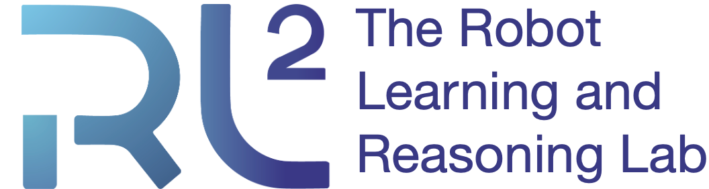
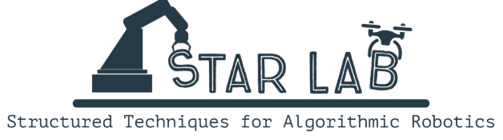
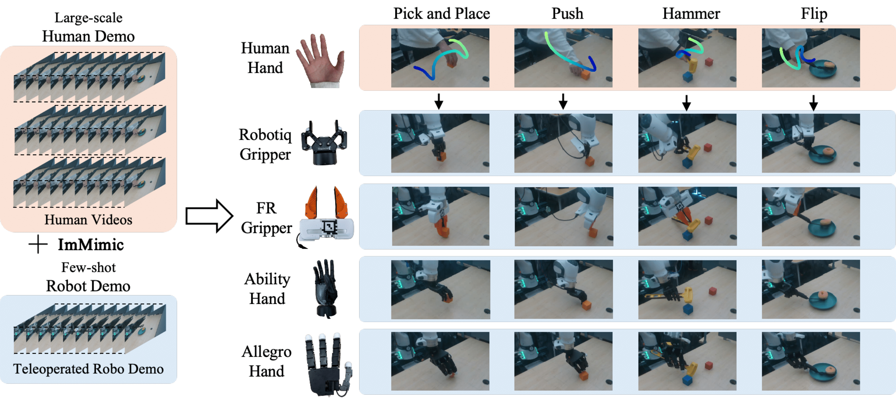

<div align="center">

# ImMimic: Cross-Domain Imitation from Human Videos via Mapping and Interpolation

**Yangcen Liu\*** · **Woo Chul Shin\*** · Yunhai Han · Zhenyang Chen · <br/> Harish Ravichandar · Danfei Xu  
Georgia Institute of Technology · CoRL 2025 (<span style="color:#ff0000; font-weight:700;">Oral</span>)  
(\* equal contribution)

<br/>

<a href="https://arxiv.org/abs/2509.10952">Paper</a>
&nbsp;·&nbsp;
<a href="https://sites.google.com/view/immimic">Project Page</a>
&nbsp;·&nbsp;
<a href="https://github.com/GaTech-RL2/ImMimic-CoRL2025">Code</a>
&nbsp;·&nbsp;
<a href="https://drive.google.com/drive/folders/1IaLEeQNYUdXy4hYmAogrjR-jAjqiqORu?usp=drive_link">Data</a>
&nbsp;·&nbsp;
<a href="https://www.youtube.com/watch?v=PbjVB8QQjpo">Video</a>

</div>

<p align="center">
  <a href="https://rl2.cc.gatech.edu/">
    
  </a>
  &nbsp;&nbsp;&nbsp;&nbsp;
  <a href="https://star-lab.cc.gatech.edu/">
    
  </a>
</p>


## Overview
ImMimic is an embodiment-agnostic co-training framework that leverages abundant human videos and a small amount of teleoperated robot demonstrations. It bridges domain gaps via (1) retargeted human hand trajectories as action supervision, (2) DTW mapping (action- or visual-based), and (3) MixUp interpolation in latent/action space to create intermediate domains for adaptation.

<p align="center">
  
</p>

**Pipeline**:
1. Collect robot demonstrations (teleoperation).
2. Extract human actions from videos and retarget to the robot action space.
3. Map human ↔ robot trajectories with DTW (action-based or visual-based).
4. MixUp interpolate paired trajectories in latent and action space.
5. Co-train diffusion policy on robot demos + interpolated human data.


## Setup

1. Create the conda env
```
conda create -n immimic python=3.10
conda activate immimic
```

2. Install MuJoCo
```
pip install "mujoco==3.3.0"
```

3. Install PyTorch
```
pip install torch==2.6.0 torchvision==0.21.0
```

4. Install robosuite v1.5.1
```
git clone https://github.com/ARISE-Initiative/robosuite.git
cd robosuite
git checkout v1.5.1 
pip install -e . --no-deps
cd ..
```
5. Install robomimic
```
cd robomimic
pip install -e .
cd ..
```
6. Install requirements.txt
```
pip install -r requirements.txt
pip install diffusers==0.36.0
pip install huggingface-hub==0.30.2
```

## Dataset Format

```
Group: data
└── Group: demo_t
    ├── Dataset: action_absolute         (T, A)
    │   # [0:3]   eef_position (x, y, z)
    │   # [3:6]   eef_orientation_axis_angle (rx, ry, rz)
    │   # [6:A]   hand DOF (gripper-dependent)
    │
    └── Group: obs
        ├── Dataset: agentview_image     (T, H=180, W=320, 3)
        ├── Dataset: eef_pose_w_gripper  (T, P)
        │   # [0:3]   eef_position (x, y, z)
        │   # [3:7]   eef_orientation_quaternion (w, x, y, z)
        │   # [7:P]   hand DOF
        └── Dataset: wrist_image         (T, H=180, W=320, 3)
Group: mask
├── Dataset: train  (N_train,) # demo keys
└── Dataset: valid  (N_valid,) # demo keys

# Hand DOF convention:
#   Ability Hand : 6 DOF
#   Allegro Hand : 16 DOF
#   Fin Ray      : 1 DOF
#   Robotiq      : 1 DOF
#
# Therefore:
#   A = 6 + hand_dof
#   P = 7 + hand_dof
```
* Each demo_t is a variable-length trajectory of length T.
* Sample dataset can be found [here](https://drive.google.com/drive/folders/1IaLEeQNYUdXy4hYmAogrjR-jAjqiqORu?usp=drive_link). Put dataset at `robomimic/robomimic/datasets`


## Data Processing
1. Compute action stats
```
python robomimic/robomimic/datasets/utils/compute_action_stats.py --hdf5_path robomimic/robomimic/datasets/umi_pick_place_0_5.hdf5 --output_path robomimic/robomimic/datasets/umi_pick_place_action_stats.json
```
2. Map human-robot data using DTW (to be updated)

## Training
```
python -u robomimic/robomimic/scripts/train.py --config robomimic/robomimic/exps/configs/umi_pick_place_100_5.json
```

## Rollout
* Install [gello_software](https://github.com/wuphilipp/gello_software) to run rollout code.

```
python robomimic/robomimic/scripts/run_trained_policy.py --ckpt_path /robomimic/robomimic/exps/policy_trained_models/umi_pick_place/test/20260104222851/models/model_epoch_300.pth --norm_path robomimic/robomimic/datasets/umi_pick_place_action_stats.json
```